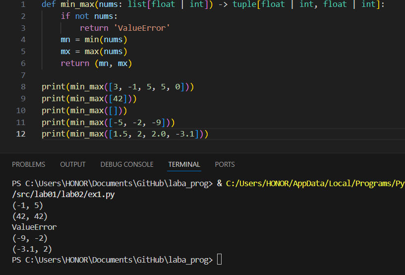
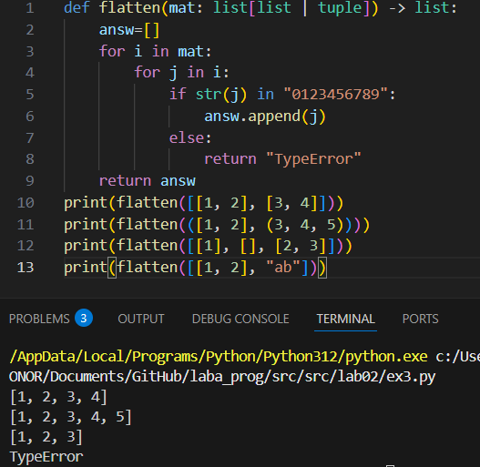
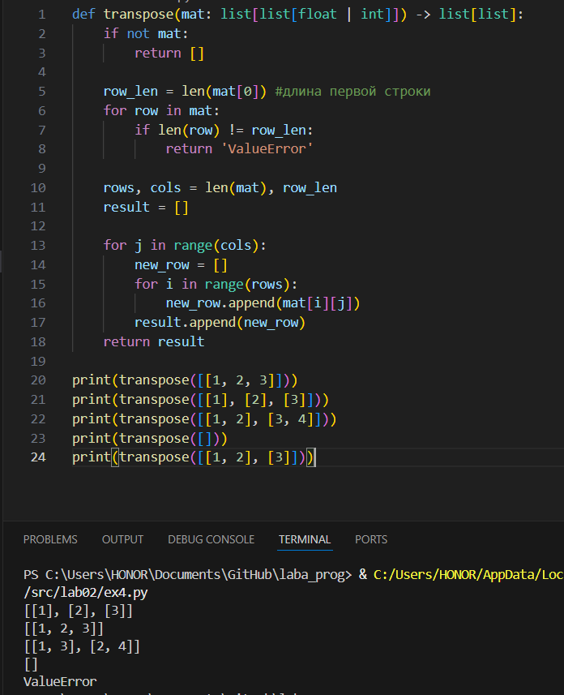
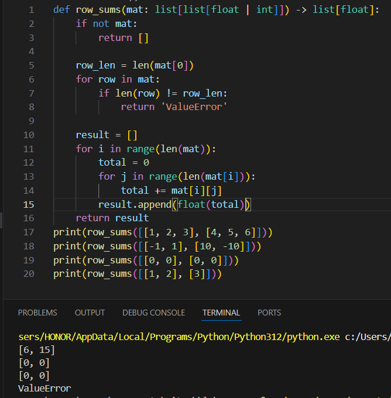
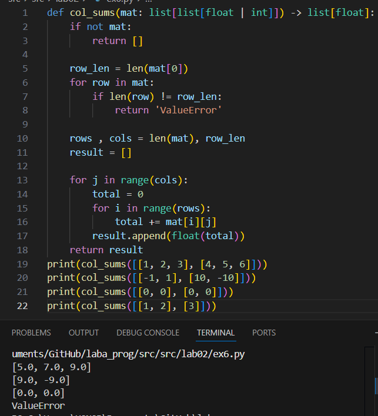
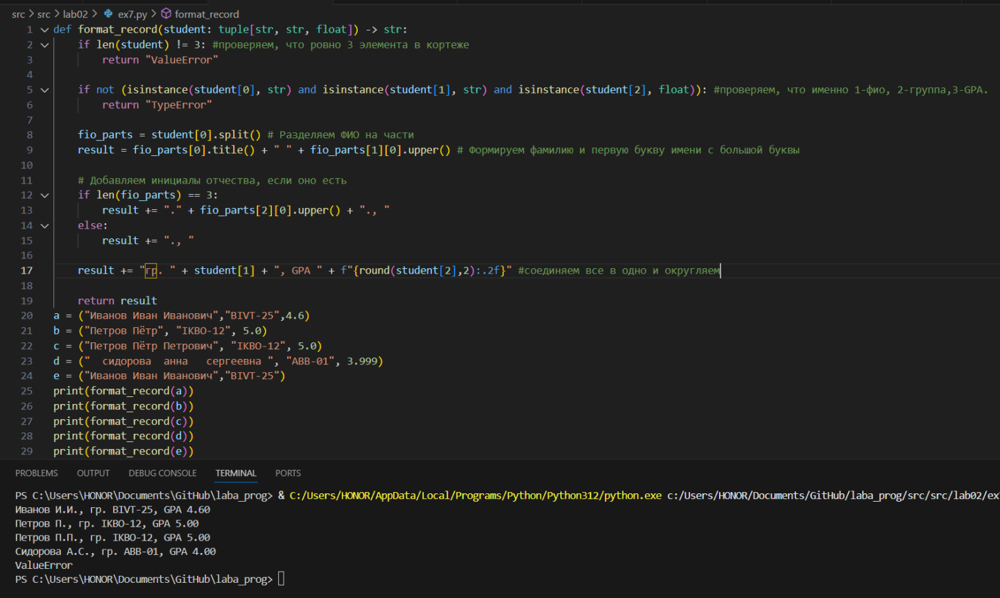
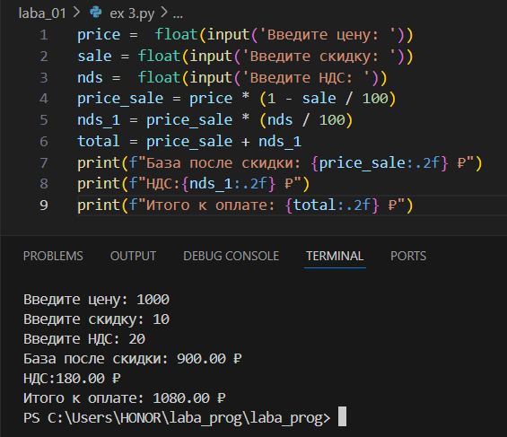
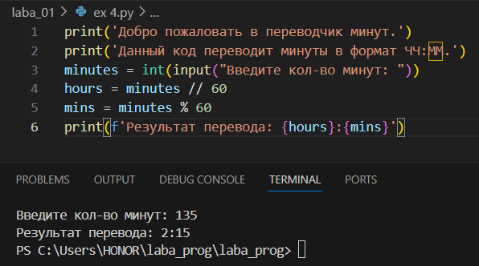
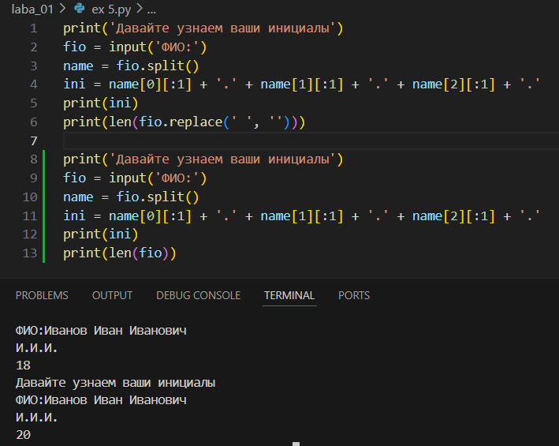
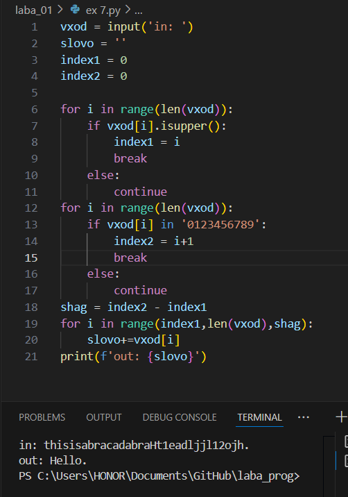

## Лабораторная работа 2
### Задание 1 — arrays.py
#### min_max.py
```python
def min_max(nums: list[float | int]) -> tuple[float | int, float | int]:
    if not nums:
        return 'ValueError'
    mn = min(nums)
    mx = max(nums)
    return (mn, mx)

print(min_max([3, -1, 5, 5, 0]))
print(min_max([42]))
print(min_max([]))
print(min_max([-5, -2, -9]))
print(min_max([1.5, 2, 2.0, -3.1]))
```


#### unique_sorted.py
```python
def unique_sorted(nums):
    return sorted(set(nums))
print(unique_sorted([3, 1, 2, 1, 3]))
print(unique_sorted([]))
print(unique_sorted([-1, -1, 0, 2, 2]))
print(unique_sorted([1.0, 1, 2.5, 2.5, 0]))
```


#### flatten
```python
def flatten(mat: list[list | tuple]) -> list:
    answ=[]
    for i in mat:
        for j in i:
            if str(j) in "0123456789":
                answ.append(j)
            else:
                return "TypeError"    
    return answ
print(flatten([[1, 2], [3, 4]]))
print(flatten(([1, 2], (3, 4, 5))))
print(flatten([[1], [], [2, 3]]))
print(flatten([[1, 2], "ab"]))
```


### Задание B — matrix.py
#### transpose
```python
def transpose(mat: list[list[float | int]]) -> list[list]:
    if not mat:
        return []
    
    row_len = len(mat[0]) #длина первой строки
    for row in mat:
        if len(row) != row_len:
            return 'ValueError'

    rows, cols = len(mat), row_len
    result = []

    for j in range(cols):         
        new_row = []
        for i in range(rows):
            new_row.append(mat[i][j])
        result.append(new_row)
    return result

print(transpose([[1, 2, 3]]))
print(transpose([[1], [2], [3]]))
print(transpose([[1, 2], [3, 4]]))
print(transpose([]))
print(transpose([[1, 2], [3]]))
```


#### row_sums
```python
def row_sums(mat: list[list[float | int]]) -> list[float]:
    if not mat:
        return []
    
    row_len = len(mat[0])
    for row in mat:
        if len(row) != row_len:
            return 'ValueError'
        
    result = []
    for i in range(len(mat)):
        total = 0
        for j in range(len(mat[i])):
            total += mat[i][j]
        result.append(float(total))
    return result
print(row_sums([[1, 2, 3], [4, 5, 6]]))
print(row_sums([[-1, 1], [10, -10]]))
print(row_sums([[0, 0], [0, 0]]))
print(row_sums([[1, 2], [3]]))
```


#### col_sums
```python
def col_sums(mat: list[list[float | int]]) -> list[float]:
    if not mat:
        return []
    
    row_len = len(mat[0])
    for row in mat:
        if len(row) != row_len:
            return 'ValueError'
    
    rows , cols = len(mat), row_len
    result = []

    for j in range(cols):
        total = 0
        for i in range(rows):
            total += mat[i][j]
        result.append(float(total))
    return result
print(col_sums([[1, 2, 3], [4, 5, 6]]))
print(col_sums([[-1, 1], [10, -10]]))
print(col_sums([[0, 0], [0, 0]]))
print(col_sums([[1, 2], [3]]))
```


### Задание C — tuples.py
```python
def format_record(student: tuple[str, str, float]) -> str:
    if len(student) != 3: #проверяем, что ровно 3 элемента в кортеже
        return "ValueError"
    
    if not (isinstance(student[0], str) and isinstance(student[1], str) and isinstance(student[2], float)): #проверяем, что именно 1-фио, 2-группа,3-GPA.
        return "TypeError"

    fio_parts = student[0].split() # Разделяем ФИО на части
    result = fio_parts[0].title() + " " + fio_parts[1][0].upper() # Формируем фамилию и первую букву имени с большой буквы
    
    # Добавляем инициалы отчества, если оно есть
    if len(fio_parts) == 3:
        result += "." + fio_parts[2][0].upper() + "., "
    else:
        result += "., "

    result += "гр. " + student[1] + ", GPA " + f"{round(student[2],2):.2f}" #соединяем все в одно и округляем

    return result
a = ("Иванов Иван Иванович","BIVT-25",4.6)
b = ("Петров Пётр", "IKBO-12", 5.0)
c = ("Петров Пётр Петрович", "IKBO-12", 5.0)
d = ("  сидорова  анна   сергеевна ", "ABB-01", 3.999)
e = ("Иванов Иван Иванович","BIVT-25")
print(format_record(a))
print(format_record(b))
print(format_record(c))
print(format_record(d))
print(format_record(e))
```


## Лабораторная работа 1

### Задание 1
```python
print('Сколько тебе будет через год?')
name = input('Имя: ')
age = int(input('Возраст:'))
print(f'Привет, {name}! Через год тебе будет {age + 1}.')
```


### Задание 2
```python
a = float(input('Число a:').replace(',','.'))
b = float(input('Число b:').replace(',','.'))
sum = a + b
arf = sum/2
print('Сумма = ', round(sum,2))
print('Среднее арифмитическое = ', round(arf,2))
```


### Задание 3
```python
price =  float(input('Введите цену: '))
sale = float(input('Введите скидку: '))
nds =  float(input('Введите НДС: '))
price_sale = price * (1 - sale / 100)
nds_1 = price_sale * (nds / 100)
total = price_sale + nds_1
print(f"База после скидки: {price_sale:.2f} ₽")
print(f"НДС:{nds_1:.2f} ₽")
print(f"Итого к оплате: {total:.2f} ₽")
```


### Задание 4
```python
print('Добро пожаловать в переводчик минут.')
print('Данный код переводит минуты в формат ЧЧ:ММ.')
minutes = int(input("Введите кол-во минут: "))
hours = minutes // 60
mins = minutes % 60
print(f'Результат перевода: {hours}:{mins}')
```


### Задание 5
```python
print('Давайте узнаем ваши инициалы')
fio = input('ФИО:')
name = fio.split()
ini = name[0][:1] + '.' + name[1][:1] + '.' + name[2][:1] + '.'
print(ini)
print(len(fio.replace(' ', '')))
```

### Задание 6
```python
N = int(input())
och = []
zaoch = []
while N > 0:
    fio = input()
    N = N - 1
    if 'True' in fio:
        och.append(fio)
    elif 'False' in fio:
        zaoch.append(fio)
print(len(och), len(zaoch))
```

### Задание 7
```python
vxod = input('in: ')
slovo = ''
index1 = 0 
index2 = 0

for i in range(len(vxod)):
    if vxod[i].isupper():
        index1 = i 
        break
    else:
        continue 
for i in range(len(vxod)):
    if vxod[i] in '0123456789':
        index2 = i+1
        break
    else:
        continue
shag = index2 - index1
for i in range(index1,len(vxod),shag):
    slovo+=vxod[i]
print(f'out: {slovo}')
```
