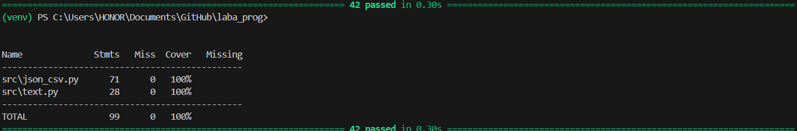

## Лабораторная работа 7
### A. Тесты для text.py
```python
import pytest
from src.text import normalize, tokenize, count_freq, top_n


@pytest.mark.parametrize(
    "source, expected",
    [
        ("ПрИвЕт\nМИр\t", "привет мир"),
        ("ёжик, Ёлка", "ежик, елка"),
        ("Hello\r\nWorld", "hello world"),
        ("  двойные   пробелы  ", "двойные пробелы"),
        ("", ""),
        ("   ", ""),
    ],
)
def test_normalize(source, expected):
    assert normalize(source) == expected


@pytest.mark.parametrize(
    "text, expected",
    [
        ("привет мир", ["привет", "мир"]),
        ("hello world test", ["hello", "world", "test"]),
        ("", []),
        ("   ", []),
        ("знаки, препинания! тест.", ["знаки", "препинания", "тест"]),
    ],
)
def test_tokenize(text, expected):
    assert tokenize(text) == expected


def test_count_freq_basic():
    tokens = ["apple", "banana", "apple", "cherry", "banana", "apple"]
    result = count_freq(tokens)
    expected = {"apple": 3, "banana": 2, "cherry": 1}
    assert result == expected


def test_count_freq_empty():
    assert count_freq([]) == {}


def test_top_n_basic():
    freq = {"apple": 5, "banana": 3, "cherry": 7, "date": 1}
    result = top_n(freq, 2)
    expected = [("cherry", 7), ("apple", 5)]
    assert result == expected


def test_top_n_tie_breaker():
    freq = {"banana": 3, "apple": 3, "cherry": 3}
    result = top_n(freq, 3)
    expected = [("apple", 3), ("banana", 3), ("cherry", 3)]
    assert result == expected


def test_top_n_empty():
    assert top_n({}, 5) == []


def test_full_pipeline():
    text = "Привет мир! Привет всем. Мир прекрасен."
    normalized = normalize(text)
    tokens = tokenize(normalized)
    freq = count_freq(tokens)
    top_words = top_n(freq, 2)

    assert normalized == "привет мир! привет всем. мир прекрасен."
    assert tokens == [
        "привет",
        "мир",
        "привет",
        "всем",
        "мир",
        "прекрасен",
    ]
    assert freq == {"привет": 2, "мир": 2, "всем": 1, "прекрасен": 1}
    assert top_words == [("мир", 2), ("привет", 2)]

```

### B. Тесты для json_csv.py

```python
import pytest
import json
import csv
from src.json_csv import json_to_csv, csv_to_json


# Базовые тесты для успешных сценариев
@pytest.mark.parametrize(
    "test_name,data,expected_count",
    [
        ("basic", [{"name": "Alice", "age": 25}, {"name": "Bob", "age": 30}], 2),
        (
            "complex_data",
            [{"name": "Alice", "age": 25, "active": True, "score": 95.5}],
            1,
        ),
        (
            "different_order",
            [{"name": "Alice", "age": 25}, {"age": 30, "name": "Bob"}],
            2,
        ),
        ("empty_values", [{"name": "Alice", "age": 25, "comment": ""}], 1),
        ("unicode", [{"name": "Алиса", "message": "Привет! 🌍"}], 1),
    ],
)
def test_json_to_csv_success(tmp_path, test_name, data, expected_count):
    """Параметризованный тест успешных преобразований JSON в CSV"""
    src = tmp_path / f"{test_name}.json"
    dst = tmp_path / f"{test_name}.csv"

    src.write_text(json.dumps(data, ensure_ascii=False), encoding="utf-8")
    json_to_csv(str(src), str(dst))

    assert dst.exists() #проверка_создания_файла
    with dst.open(encoding="utf-8") as f:
        rows = list(csv.DictReader(f))

    assert len(rows) == expected_count
    assert rows[0]["name"] == data[0]["name"]


@pytest.mark.parametrize(
    "test_name,csv_content,expected_count",
    [
        ("basic", "name,age\nAlice,25\nBob,30", 2),
        ("special_chars", 'name,description\n"Alice","Test, comma"', 1),#специальные_символы #кавычки
        ("semicolon_delim", "name;age\nAlice;25\nBob;30", 2),
    ],
)
def test_csv_to_json_success(tmp_path, test_name, csv_content, expected_count):
    """Параметризованный тест успешных преобразований CSV в JSON"""
    src = tmp_path / f"{test_name}.csv" #входные_данные
    dst = tmp_path / f"{test_name}.json" #выходные_данные

    src.write_text(csv_content, encoding="utf-8")
    csv_to_json(str(src), str(dst))

    assert dst.exists()
    with dst.open(encoding="utf-8") as f:
        data = json.load(f)  #загрузка_json

    assert len(data) == expected_count


# Тесты для ошибок JSON
@pytest.mark.parametrize(
    "test_name,file_content,expected_error",
    [
        ("file_not_found", None, FileNotFoundError),
        ("invalid_json", "{ invalid json }", ValueError),
        ("empty_file", "", ValueError),
        ("not_list", '{"name": "test"}', ValueError),
        ("empty_list", "[]", ValueError),
        ("mixed_list", '[{"name": "test"}, "not_dict"]', ValueError),
        ("invalid_encoding", b"\xff\xfe\x00\x00", ValueError),
    ],
)
def test_json_to_csv_errors(tmp_path, test_name, file_content, expected_error):
    """Параметризованный тест ошибок JSON в CSV"""
    src = tmp_path / f"{test_name}.json"
    dst = tmp_path / "output.csv"

    if file_content is None:
        # Тест для несуществующего файла
        with pytest.raises(expected_error):
            json_to_csv("nonexistent.json", str(dst))
    else: 
        # Тест для файла с ошибкой в содержимом
        if isinstance(file_content, bytes):
            src.write_bytes(file_content)
        else:
            src.write_text(file_content, encoding="utf-8")

        with pytest.raises(expected_error): #проверка_исключения
            json_to_csv(str(src), str(dst))


# Тесты для ошибок CSV
@pytest.mark.parametrize(
    "test_name,file_content,expected_error",
    [
        ("file_not_found", None, FileNotFoundError),
        ("empty_file", "", ValueError),
        ("empty_header", "\nAlice,25", ValueError),
        ("empty_columns", "name,,age\nAlice,25,30", ValueError),
        ("invalid_encoding", b"\xff\xfe\x00\x00", ValueError),
    ],
)
def test_csv_to_json_errors(tmp_path, test_name, file_content, expected_error):
    """Параметризованный тест ошибок CSV в JSON"""
    src = tmp_path / f"{test_name}.csv"
    dst = tmp_path / "output.json"

    if file_content is None:
        # Тест для несуществующего файла
        with pytest.raises(expected_error):
            csv_to_json("nonexistent.csv", str(dst))
    else:
        # Тест для файла с ошибкой в содержимом
        if isinstance(file_content, bytes):
            src.write_bytes(file_content)
        else:
            src.write_text(file_content, encoding="utf-8")

        with pytest.raises(expected_error):
            csv_to_json(str(src), str(dst))


# Специальные тесты
def test_json_csv_roundtrip(tmp_path):
    """Тест полного цикла преобразования"""
    original_json = tmp_path / "original.json"
    intermediate_csv = tmp_path / "intermediate.csv"
    final_json = tmp_path / "final.json"

    original_data = [{"name": "Alice", "age": 25}, {"name": "Bob", "age": 30}]
    original_json.write_text(json.dumps(original_data), encoding="utf-8")

    json_to_csv(str(original_json), str(intermediate_csv))
    csv_to_json(str(intermediate_csv), str(final_json))

    with final_json.open(encoding="utf-8") as f:
        final_data = json.load(f) #чтение_результата

    assert len(final_data) == 2 # #проверка_сохранения_данных
    assert final_data[0]["name"] == "Alice" #проверка_целостности


def test_unexpected_errors(monkeypatch, tmp_path):
    """Тест неожиданных ошибок"""
    # Тест для JSON
    src_json = tmp_path / "test.json"
    dst_json = tmp_path / "test.csv"
    src_json.write_text('[{"name": "test"}]', encoding="utf-8")

    def mock_getsize(path):
        raise RuntimeError("Unexpected error")

    monkeypatch.setattr("os.path.getsize", mock_getsize) #подмена_функции

    with pytest.raises(ValueError, match="Неожиданная ошибка"):
        json_to_csv(str(src_json), str(dst_json))

    # Тест для CSV 
    src_csv = tmp_path / "test.csv"
    dst_csv = tmp_path / "test.json"
    src_csv.write_text("name,age\nAlice,25", encoding="utf-8")
    original_open = open

    def mock_open(*args, **kwargs):
        if args[0].endswith(".csv") and "r" in args[1]:
            raise RuntimeError("Unexpected read error")
        return original_open(*args, **kwargs)

    monkeypatch.setattr("builtins.open", mock_open)

    with pytest.raises(ValueError, match="Неожиданная ошибка"):
        csv_to_json(str(src_csv), str(dst_csv))


def test_csv_empty_data_with_header(tmp_path):
    """Тест для CSV только с заголовком"""
    src = tmp_path / "only_header.csv"
    dst = tmp_path / "test.json"

    src.write_text("name,age", encoding="utf-8")#преобразование_пустого_csv

    csv_to_json(str(src), str(dst))

    assert dst.exists()
    with dst.open(encoding="utf-8") as f:
        data = json.load(f)

    assert len(data) == 0  # Пустой список, так как нет данных


def test_json_to_csv_wrong_extension(tmp_path):
    """Тест: JSON файл с неправильным расширением"""
    src = tmp_path / "test.txt"  # Не .json файл
    dst = tmp_path / "test.csv"

    src.write_text('[{"name": "test"}]', encoding="utf-8") #json_в_txt_файле

    with pytest.raises(ValueError, match="не является JSON файлом"):
        json_to_csv(str(src), str(dst))


def test_csv_to_json_wrong_extension(tmp_path):
    """Тест: CSV файл с неправильным расширением"""
    src = tmp_path / "test.txt"  # Не .csv файл
    dst = tmp_path / "test.json"

    src.write_text("name,age\nAlice,25", encoding="utf-8")

    with pytest.raises(ValueError, match="не является CSV файлом"):
        csv_to_json(str(src), str(dst))
```
### C. Стиль кода (black)


### ★ Дополнительное задание


