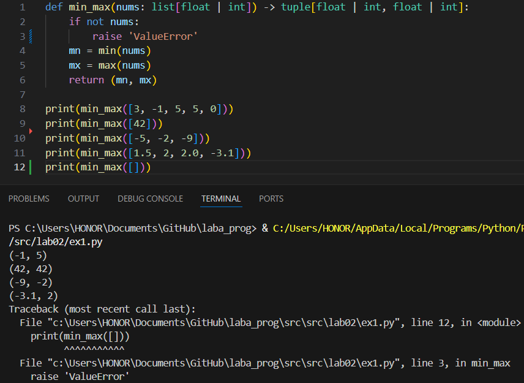
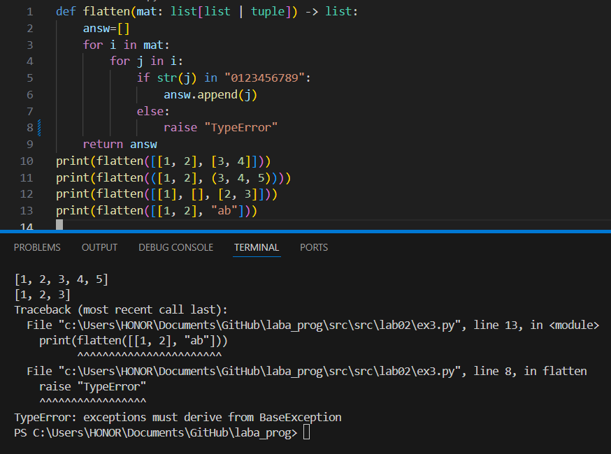
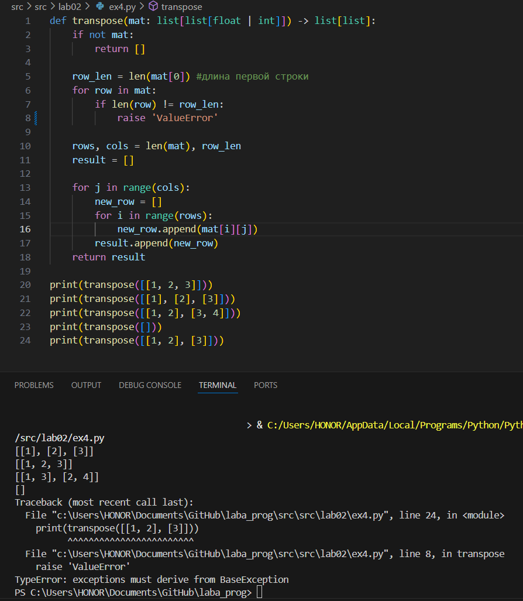
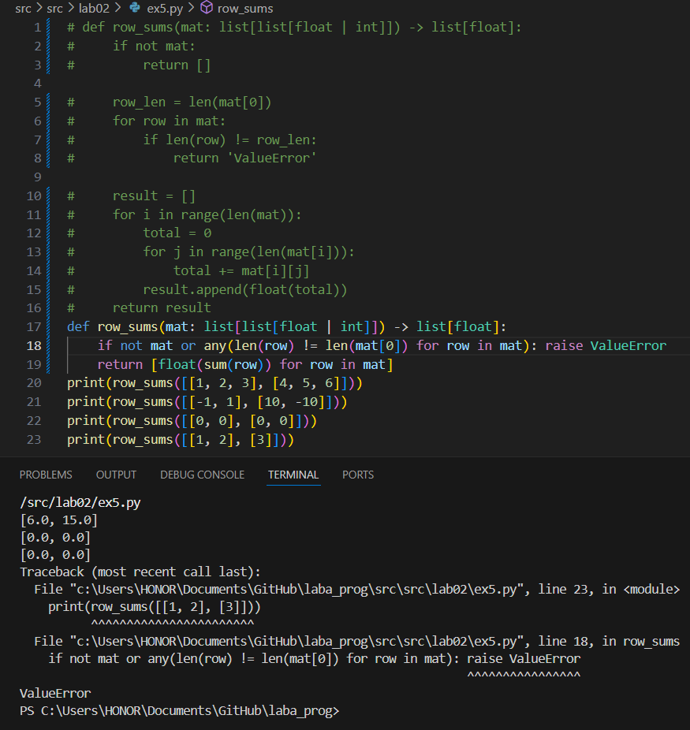
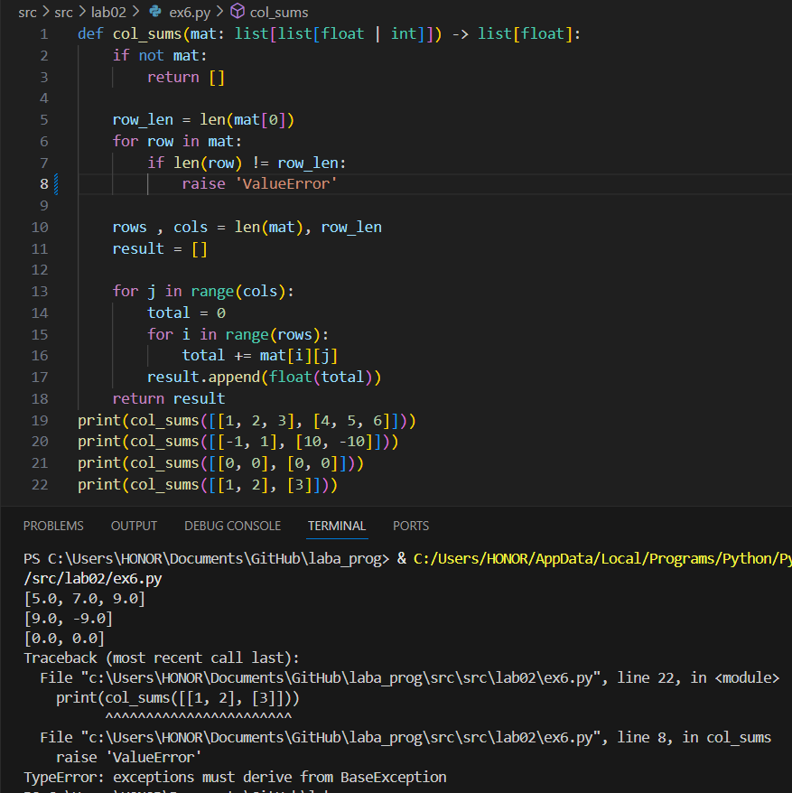
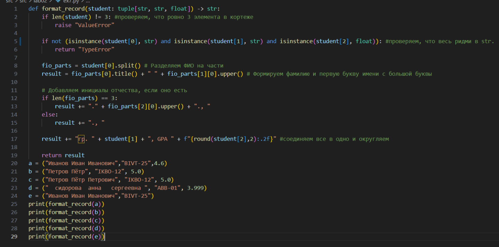

## Лабораторная работа 2
### Задание 1 — arrays.py
#### min_max.py минимальное и максимальное
```python
def min_max(nums: list[float | int]) -> tuple[float | int, float | int]:
    if not nums:
        raise 'ValueError'
    mn = min(nums)
    mx = max(nums)
    return (mn, mx)

print(min_max([3, -1, 5, 5, 0]))
print(min_max([42]))
print(min_max([-5, -2, -9]))
print(min_max([1.5, 2, 2.0, -3.1]))
print(min_max([]))
```


#### unique_sorted.py отсортированные списки уникальных чисел 
```python
def unique_sorted(nums):
    raise sorted(set(nums))
print(unique_sorted([3, 1, 2, 1, 3]))
print(unique_sorted([-1, -1, 0, 2, 2]))
print(unique_sorted([1.0, 1, 2.5, 2.5, 0]))
print(unique_sorted([]))
```


#### flatten выравнивание вложенных списков
```python
def flatten(mat: list[list | tuple]) -> list:
    answ=[]
    for i in mat:
        for j in i:
            if str(j) in "0123456789":
                answ.append(j)
            else:
                raise "TypeError"    
    return answ
print(flatten([[1, 2], [3, 4]]))
print(flatten(([1, 2], (3, 4, 5))))
print(flatten([[1], [], [2, 3]]))
print(flatten([[1, 2], "ab"]))
```


### Задание B — matrix.py
#### transpose преобразование строк в столбцы
```python
def transpose(mat: list[list[float | int]]) -> list[list]:
    if not mat:
        return []
    
    row_len = len(mat[0])
    for row in mat:
        if len(row) != row_len:
            raise 'ValueError'

    rows, cols = len(mat), row_len 
    result = []

    for j in range(cols):         
        new_row = []
        for i in range(rows):
            new_row.append(mat[i][j])
        result.append(new_row)
    return result

print(transpose([[1, 2, 3]]))
print(transpose([[1], [2], [3]]))
print(transpose([[1, 2], [3, 4]]))
print(transpose([]))
print(transpose([[1, 2], [3]]))
```


#### row_sums сумма строк
```python
def row_sums(mat: list[list[float | int]]) -> list[float]:
    if not mat or any(len(row) != len(mat[0]) for row in mat): raise ValueError
    return [float(sum(row)) for row in mat]
print(row_sums([[1, 2, 3], [4, 5, 6]]))
print(row_sums([[-1, 1], [10, -10]]))
print(row_sums([[0, 0], [0, 0]]))
print(row_sums([[1, 2], [3]]))
```


#### col_sums сумма элементов в каждом столбце
```python
def col_sums(mat: list[list[float | int]]) -> list[float]:
    if not mat:
        return []
    
    row_len = len(mat[0])
    for row in mat:
        if len(row) != row_len:
            raise 'ValueError'
    
    rows , cols = len(mat), row_len
    result = []

    for j in range(cols):
        total = 0
        for i in range(rows):
            total += mat[i][j]
        result.append(float(total))
    return result
print(col_sums([[1, 2, 3], [4, 5, 6]]))
print(col_sums([[-1, 1], [10, -10]]))
print(col_sums([[0, 0], [0, 0]]))
print(col_sums([[1, 2], [3]]))
```


### Задание C — tuples.py
```python
def format_record(student: tuple[str, str, float]) -> str:
    if len(student) != 3: #проверяем, что ровно 3 элемента в кортеже
        raise "ValueError"
    
    if not (isinstance(student[0], str) and isinstance(student[1], str) and isinstance(student[2], float)): #проверяем,что фио строковое
        return "TypeError"

    fio_parts = student[0].split() # Разделяем ФИО на части
    result = fio_parts[0].title() + " " + fio_parts[1][0].upper() # Формируем фамилию и первую букву имени с большой буквы
    
    # Добавляем инициалы отчества, если оно есть
    if len(fio_parts) == 3:
        result += "." + fio_parts[2][0].upper() + "., "
    else:
        result += "., "

    result += "гр. " + student[1] + ", GPA " + f"{round(student[2],2):.2f}" #соединяем все в одно и округляем

    return result
a = ("Иванов Иван Иванович","BIVT-25",4.6)
b = ("Петров Пётр", "IKBO-12", 5.0)
c = ("Петров Пётр Петрович", "IKBO-12", 5.0)
d = ("  сидорова  анна   сергеевна ", "ABB-01", 3.999)
e = ("Иванов Иван Иванович","BIVT-25")
print(format_record(a))
print(format_record(b))
print(format_record(c))
print(format_record(d))
print(format_record(e))
```


