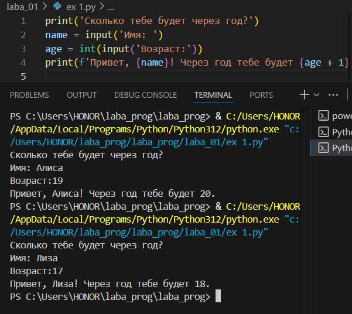
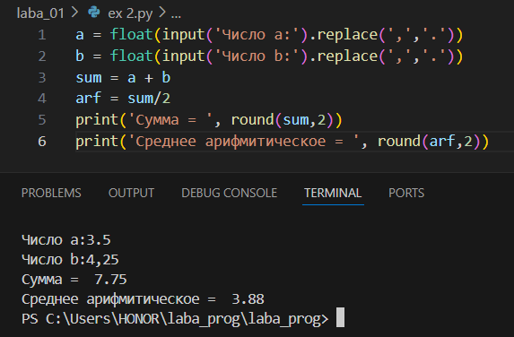
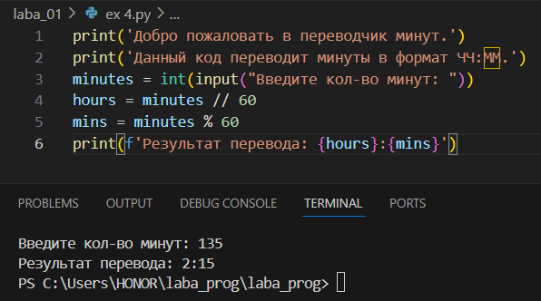
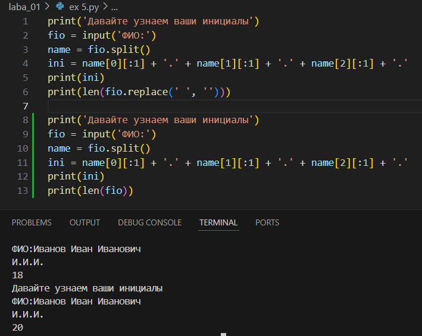
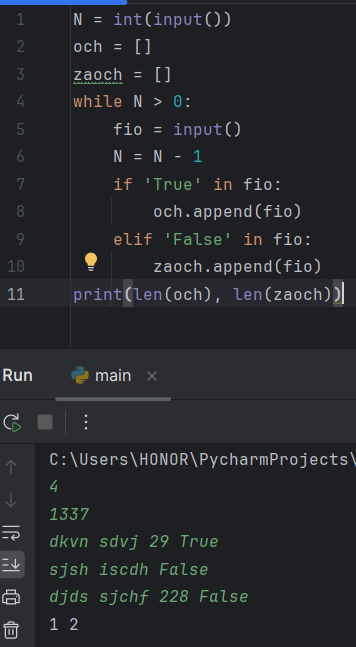
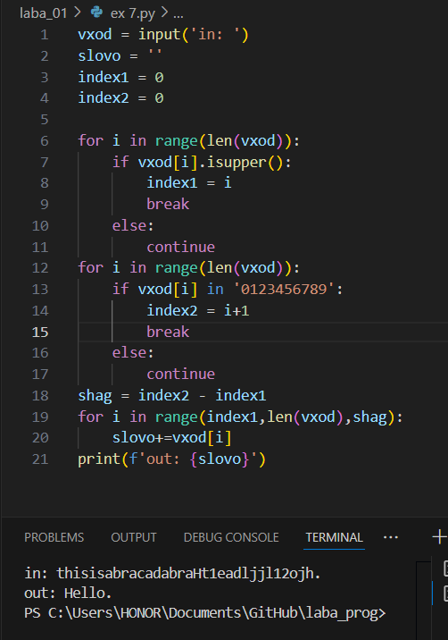

## Лабораторная работа 2
### Задание 1 — arrays.py
```python
def min_max(nums: list[float | int]) -> tuple[float | int, float | int]:
    if not nums:
        return 'ValueError'
    mn = min(nums)
    mx = max(nums)
    return (mn, mx)

print(min_max([3, -1, 5, 5, 0]))
print(min_max([42]))
print(min_max([]))
print(min_max([-5, -2, -9]))
print(min_max([1.5, 2, 2.0, -3.1]))
```


## Лабораторная работа 1

### Задание 1
```python
print('Сколько тебе будет через год?')
name = input('Имя: ')
age = int(input('Возраст:'))
print(f'Привет, {name}! Через год тебе будет {age + 1}.')
```


### Задание 2
```python
a = float(input('Число a:').replace(',','.'))
b = float(input('Число b:').replace(',','.'))
sum = a + b
arf = sum/2
print('Сумма = ', round(sum,2))
print('Среднее арифмитическое = ', round(arf,2))
```


### Задание 3
```python
price =  float(input('Введите цену: '))
sale = float(input('Введите скидку: '))
nds =  float(input('Введите НДС: '))
price_sale = price * (1 - sale / 100)
nds_1 = price_sale * (nds / 100)
total = price_sale + nds_1
print(f"База после скидки: {price_sale:.2f} ₽")
print(f"НДС:{nds_1:.2f} ₽")
print(f"Итого к оплате: {total:.2f} ₽")
```


### Задание 4
```python
print('Добро пожаловать в переводчик минут.')
print('Данный код переводит минуты в формат ЧЧ:ММ.')
minutes = int(input("Введите кол-во минут: "))
hours = minutes // 60
mins = minutes % 60
print(f'Результат перевода: {hours}:{mins}')
```


### Задание 5
```python
print('Давайте узнаем ваши инициалы')
fio = input('ФИО:')
name = fio.split()
ini = name[0][:1] + '.' + name[1][:1] + '.' + name[2][:1] + '.'
print(ini)
print(len(fio.replace(' ', '')))
```

### Задание 6
```python
N = int(input())
och = []
zaoch = []
while N > 0:
    fio = input()
    N = N - 1
    if 'True' in fio:
        och.append(fio)
    elif 'False' in fio:
        zaoch.append(fio)
print(len(och), len(zaoch))
```

### Задание 7
```python
vxod = input('in: ')
slovo = ''
index1 = 0 
index2 = 0

for i in range(len(vxod)):
    if vxod[i].isupper():
        index1 = i 
        break
    else:
        continue 
for i in range(len(vxod)):
    if vxod[i] in '0123456789':
        index2 = i+1
        break
    else:
        continue
shag = index2 - index1
for i in range(index1,len(vxod),shag):
    slovo+=vxod[i]
print(f'out: {slovo}')
```
