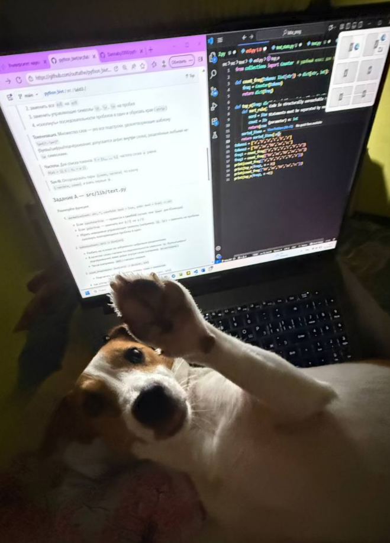

## Лабораторная работа 3
### Задание A — src/lib/text.py
#### normalize - приведение текста к стандартному виду
```python
import re  # модуль для работы с регулярными выражениями

def normalize(text: str, *, casefold: bool = True, yo2e: bool = True) -> str:
    if not isinstance(text, str):
        raise TypeError

    text = re.sub(r'\s+', ' ', text)

    if yo2e:
        text = text.replace('ё', 'е').replace('Ё', 'Е')

    if casefold:
        text = text.casefold()

    return text.strip()
print(normalize("ПрИвЕт\nМИр\t"))        
print(normalize("ёжик, Ёлка")) 
print(normalize("Hello\r\nWorld"))      
print(normalize("  двойные   пробелы  "))
```


#### tokenize - разбивает слова на отдельные слова/части
```python
import re
def tokenize(text: str) -> list[str]:
    if not isinstance(text,str):
        raise TypeError
    tokens = re.findall(r'[\w-]+', text) 
    return tokens
print(tokenize("привет мир"))
print(tokenize("hello,world!!!"))
print(tokenize("по-настоящему круто"))
print(tokenize("2025 год"))
print(tokenize("emoji 😀 не слово"))
```


#### count_freq + top_n - сколько раз повторяется каждое слово
```python
from collections import Counter  # ф-ия для подсчёта повторений
def count_freq(tokens: list[str]) -> dict[str, int]:
    freq = Counter(tokens)
    return dict(freq) #превращаем в словарь
def top_n(freq: dict[str, int], n: int = 5) -> list[tuple[str, int]]:
    sorted_items = sorted(freq.items(), key=lambda x: (-x[1], x[0]))
    # 1)проверащаем в список с кортежами, 2)сортируем по частоте, потом по токенам
    return sorted_items[:n]
tokens1 = ["a","b","a","c","b","a"]
tokens2 = ["bb","aa","bb","aa","cc"]
freq1 = count_freq(["a","b","a","c","b","a"])
freq2 = count_freq(["bb","aa","bb","aa","cc"])
print(count_freq(["a","b","a","c","b","a"]))
print(top_n(freq1, n = 2))
print(count_freq(["bb","aa","bb","aa","cc"]))
print(top_n(freq2, n =2))
```


### Задание B — src/text_stats.py (скрипт со stdin)
####Вводим в PowerShell эту команду для изменения кодировки Windows: $OutputEncoding = [System.Text.Encoding]::UTF8 После этого импортируем файл с функциями и просто создаем функцию с выводом результата. После функции создаем строку, которую принимаем из PowerShell (и декодируем её)
```python
import sys
from text import *
def stats(text):

    # Нормализация текста
    text = normalize(text)

    # Разбиваем на слова
    tokens = tokenize(text)

    # Подсчёт частот
    freq = count_freq(tokens)

    # Топ-5 слов
    top = top_n(freq, n=5)

    # Вывод статистики
    print(f"Всего слов: {len(tokens)}")
    print(f"Уникальных слов: {len(freq)}")
    print("Топ-5:")
    for word, count in top:
        print(f"{word}:{count}")

text_in = sys.stdin.buffer.read().decode('utf-8')
stats(text_in)

```


