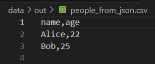

## Лабораторная работа 9
### A. Реализовать класс Student (models.py)
```python
import csv
from pathlib import Path
from models import student 
import sys
from typing import List
sys.path.append(r"C:\Users\HONOR\Documents\GitHub\laba_prog\src")
class Group():
    def __init__(self, storage_path: str):
        self.path = Path(storage_path)
        if not self.path.exists():
            self.path.write_text("", encoding='utf-8')
        if not self.path.read_text(encoding='utf-8').split('\n')[0] == 'fio,birthdate,group,gpa': # Проверка корректности заголовка CSV файла
            raise ValueError('Не корректный заголовок')
        with open(self.path, 'r', encoding='utf-8') as f:
            rd = list(csv.DictReader(f))
            [student.from_dict(st) for st in rd] # Создание объектов student из каждого словаря

    def _ensure_storage_exists(self): # Метод для обеспечения существования файла хранилища
        if not self.path.exists():
            self.path.parent.mkdir(parents=True, exist_ok=True)
            with open(self.path, 'w', encoding='utf-8') as f:
                f.write('fio,birthdate,group,gpa\n')

    def _read_all(self) -> List[dict]: # Метод для чтения всех данных из файла
        self._ensure_storage_exists()
        with open(self.path, 'r', encoding='utf-8') as f:
            return list(csv.DictReader(f))

    def list(self): # Метод для получения списка всех студентов в виде списка строк
        with open(self.path, 'r', encoding='utf-8') as f:
            rd = csv.reader(f)
            next(rd)
            students = list(rd)
        return students
    
    def _write_all(self, students: List[dict]): # Метод для записи всех данных в файл
        with open(self.path, 'w', encoding='utf-8', newline='') as f:
            writer = csv.DictWriter(f, fieldnames=['fio', 'birthdate', 'group', 'gpa'])
            writer.writeheader()
            writer.writerows(students)

    def add(self, student: student): # Метод для добавления нового студента
        rows = self._read_all()
        if any(row['fio'] == student.fio for row in rows):
            raise ValueError(f"Студент {student.fio} уже существует")
        rows.append({
            'fio': student.fio,
            'birthdate': student.birthdate,
            'group': student.group,
            'gpa': str(student.gpa)
        })
        self._write_all(rows)
    

    def find(self, substr: str): # Метод для поиска студентов по подстроке в ФИО
        with open(self.path, 'r', encoding='utf-8') as f:
            rd = list(csv.DictReader(f))
        return [student.from_dict(r) for r in rd if substr in r['fio']]
    
    def remove(self, fio: str): # Метод для удаления студента по ФИО
        with open(self.path, 'r', encoding='utf-8') as f:
            rd = csv.DictReader(f)
            data_new = [r for r in rd if fio not in r['fio']]
        with open(self.path, 'w', newline='', encoding='utf-8') as f:
            wr = csv.DictWriter(f, fieldnames=list(data_new[0].keys()))
            wr.writeheader()
            wr.writerows(data_new)

    def update(self, fio: str, **fields): # Метод для обновления данных студента
        data = student.from_dict({'fio': fio, **fields}).to_dict()
        data.pop('fio')
        with open(self.path, 'r', encoding='utf-8') as f:
            rd = list(csv.DictReader(f))
            for r in rd:
                if fio in r['fio']:
                    r.update(data)
                    break 
        with open(self.path, 'w', newline='', encoding='utf-8') as f:
            wr = csv.DictWriter(f, fieldnames=list(rd[0].keys()))
            wr.writeheader()
            wr.writerows(rd)
if __name__ == "__main__":
     group = Group(r'C:\Users\HONOR\Documents\GitHub\laba_prog\data\students.csv')
     print(group.add(student('Буянова Елизавета Сергеевна', '2007-05-15', 'БИВТ-25-1', 4.8)))
```

### Для Для list() 
```python
print(group.list())
```

### Для Для add() 
```python
print(group.add(student('Буянова Елизавета Сергеевна', '2007-05-15', 'БИВТ-25-1', 4.8)))
```

### Для Для find() 
```python
print(group.find('Иванов Иван Иванович'))
```

### Для Для remove() 
```python
print(group.remove('Иванов Иван Иванович'))
```

### Для Для update() 
```python
print(group.update('Васильев Дмитрий Андреевич', **{'birthdate': '2007.06/24', 'group': 'БИВТ-25-4', 'gpa': 4.2}))
```

