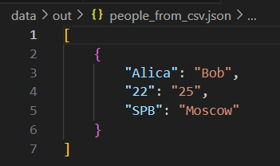

## Лабораторная работа 5
### Задание A — JSON ↔ CSV
```python

import csv
import json
import sys
import os

def json_to_csv(json_path: str, csv_path: str) -> None: #функция конвертанции JSON в CSV
    if not os.path.exists(json_path): #проверяет, существует ли файл по указанному пути
        print("FileNotFoundError") #если не существует выдает ошибку
    if os.path.getsize(json_path) == 0: #получает размер файла в байтах и проверяет, равен ли размер нулю (пустой файл или нет)
        print("ValueError1")
        sys.exit(1) #завершает программу с кодом ошибка 1
    with open(json_path, 'r', encoding='utf-8') as json_file: #безопасно открывае файл для прочтения(автомвтически закрывает после использовния #json_path - путь к файлу
        json_data = json.load(json_file) #закгружает и преобразовывает JSON данные в Python объект #json_data - переменная, содержащая данные из JSON файла
        if not all(type(x) == dict for x in json_data): #type(x) == dict - проверяет, является ли элемент словарем
                                                        #for x in json_data - перебирает все элементы в данных
                                                        #all() - проверяет, что ВСЕ элементы соответствуют условию
                                                        #if not all() - если НЕ все элементы являются словарями
            print("ValueError2") #если не все элементы подходят под условие выдает ошибку
            sys.exit(1)

    with open(csv_path, 'w', newline='', encoding='utf-8') as csvfile: #открывает CSV файл для записи(или замены)                                                                           #newline='' - убирает лишние пустые строки 
        writer = csv.DictWriter(csvfile, fieldnames=json_data[0].keys()) #csv.DictWriter() - создает объект для записи CSV из словарей
                                                                         #fieldnames=json_data[0].keys() - название колонок берутся из ключей первого словаря
        writer.writeheader() #запиывает заголовок(название колонок) в CSV файл
        writer.writerows(json_data) #записывает все данные из JSON в CSV файл

def csv_to_json(csv_path: str, json_path: str) -> None: #функция конвертанции CSV в JSON
    if not os.path.exists(csv_path): #проверяет, существует ли файл по указанному пути
        print("FileNotFoundError")  #если не существует выдает ошибку
        sys.exit(1) #завершает программу с кодом ошибка 1
    if os.path.getsize(csv_path) == 0: #получает размер файла в байтах и проверяет, равен ли размер нулю (пустой файл или нет)
        print("ValueError3")
        sys.exit(1) #завершает программу с кодом ошибка 1
    with open(csv_path, 'r', encoding='utf-8') as csvfile: #безопасно открывае файл для прочтения(автомвтически закрывает после использовния #csv_path - путь к файлу
        reader = csv.reader(csvfile) #создает объект для чтения CSV
        header = next(reader, None) #читает первую строку(заголовок), NONE - значение по умолчанию, если файл пустой
        if not header: #проверяет, что заголовк есть
            print("ValueError4") #если заголовка нет выводит ошибку
            sys.exit(1)
        reader = csv.DictReader(csvfile) #читает файл
        data = list(reader) #преобразовывет все данные в список
    with open(json_path, 'w', encoding='utf-8') as jsonfile:  #открывает JSON файл для записи(или замены)            
        json.dump(data, jsonfile, ensure_ascii=False, indent=4) #json.dump() - записывает Python объект в JSON файл
                                                                #ensure_ascii=False - разрешает русские символы
                                                                #indent=4 - красивое форматирование с отступами
csv_to_json(r"C:\Users\darin\Documents\GitHub\python_labs\date\samples\people.csv",r"C:\Users\darin\Documents\GitHub\python_labs\date\out\people_from_csv.json")

json_to_csv( r"C:\Users\darin\Documents\GitHub\python_labs\date\samples\people.json",  r"C:\Users\darin\Documents\GitHub\python_labs\date\out\people_from_json.csv" )    
```




### Задание B — CSV → XLSX

```python

```

