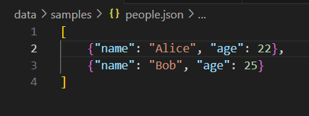

## Лабораторная работа 4
### Задание A — модуль src/lab04/io_txt_csv.py
```python
import csv
from pathlib import Path

def read_text(path: str | Path, encoding: str = "utf-8") -> str:
    try:
        return Path(path).read_text(encoding=encoding)
    except FileNotFoundError:
        return "Такого файла нету"
    except UnicodeDecodeError:
        return "Неудалось изменить кодировку"

def write_csv(rows: list[tuple | list], path: str | Path, header: tuple[str, ...] | None = None) -> None:
    p = Path(path)
    with p.open('w', newline="", encoding="utf-8") as file: # контроль переноса строк,кодироввка файла
        f = csv.writer(file)
        if header is None and rows == []:
            file_c.writerow(('a', 'b')) 
        if header is not None:
            f.writerow(header)
        if rows != []:
            const = len(rows[0])
            for i in rows:
                if len(i) != const:
                    return ValueError
        f.writerows(rows)

def ensure_parent_dir(path: str | Path) -> None:
    Path(path).parent.mkdir(parents=True, exist_ok=True)

print(read_text(r"C:\Users\HONOR\Documents\GitHub\laba_prog\data\input.txt"))
write_csv([("word","count"),("test",3)], r"C:\Users\HONOR\Documents\GitHub\laba_prog\data\check.csv") 
```



###Задание B — скрипт src/lab04/text_report.py
```python
import csv
import re
import os #пути и файлы
import sys #работа с путями

# Добавляем путь к корневой папке проекта 
project_root = os.path.join(os.path.dirname(__file__), '..')
sys.path.insert(0, project_root)

from lib.text import normalize, tokenize, count_freq, top_n

# Пути к файлам относительно корня проекта
input_path = os.path.join(project_root, 'data', 'input.txt')
output_path = os.path.join(project_root, 'data', 'report.csv')

# Читаем весь файл в правильной кодировке
with open(input_path, 'r', encoding='utf-8') as f:
    text = f.read() 

normalized = normalize(text)
words = tokenize(normalized)
freq = count_freq(words)

# Сохраняем отчет в CSV
sorted_words = sorted(freq.items(), key=lambda x: (-x[1], x[0]))

with open(output_path, 'w', encoding='utf-8', newline='') as f:
    writer = csv.writer(f)
    writer.writerow(['word', 'count'])
    for word, count in sorted_words:
        writer.writerow([word, count])

# Печатаем резюме
print(f"Всего слов: {len(words)}")
print(f"Уникальных слов: {len(freq)}")
print("Топ-5:")

top_5 = top_n(freq, 5)
for i, (word, count) in enumerate(top_5, 1):
    print(f"  {i}. {word}: {count}")
```

