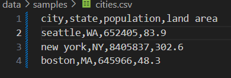

## Лабораторная работа 5
### cli_text.py
```python
import sys, os, argparse

from lib import stats_text

def cat_command(input_file: str, number_lines: bool = False):
    if not check_file(input_file):
        sys.exit(1)
    
    try:
        with open(input_file, 'r', encoding='utf-8') as f:
            for line_number, line in enumerate(f, start=1): #строки нумируем
                if number_lines:# Если включена нумерация строк
                    print(f"{line_number:6d}  {line}", end='') # Вывод номера строки (шириной 6 символов) и содержимого строки
                else:
                    print(line, end='') # Простой вывод строки
    except Exception as e:
        print(f"Ошибка при чтении файла: {e}", file=sys.stderr)
        sys.exit(1)

def check_file(file_path: str) -> bool:
    if not os.path.exists(file_path):
        print(f"Ошибка: файл '{file_path}' не существует", file=sys.stderr)
        return False
    if not os.path.isfile(file_path):
        print(f"Ошибка: '{file_path}' не является файлом", file=sys.stderr)
        return False

    return True

def stats_command(input_file: str, top_n: int = 5):
    if not check_file(input_file): #проверка файл сущ и доступен для чтения
        sys.exit(1)
    
    if top_n <= 0:
        print("Ошибка: значение --top должно быть положительным числом", file=sys.stderr)
        sys.exit(1)
    
    try:
        with open(input_file, 'r', encoding='utf-8') as f:
            text = f.read()
            stats_text(text, top_n)

    except Exception as e: # Обработка исключений
        print(f"Ошибка при анализе файла: {e}", file=sys.stderr)
        sys.exit(1)

def main():
    parser = argparse.ArgumentParser(description="Лабораторная №6")
    subparsers = parser.add_subparsers(dest="command")

    cat_parser = subparsers.add_parser("cat", help="Вывести содержимое файла")
    cat_parser.add_argument("--input", required=True) #путь к файлу
    cat_parser.add_argument("-n", action="store_true", help="Нумеровать строки")

    stats_parser = subparsers.add_parser("stats", help="Частоты слов")
    stats_parser.add_argument("--input", required=True)
    stats_parser.add_argument("--top", type=int, default=5) 

    args = parser.parse_args() #преобразует sys.argv в объект args
    #проверяет какую команду выбрал
    if args.command == "cat":
        cat_command(args.input, args.n)
    elif args.command == "stats":
        stats_command(args.input, args.top)
    else:

        parser.print_help()
        sys.exit(1)

if __name__ == "__main__":
    main()
```
### Вывод строк с номерами:

### Вывод топ слов:


### cli_convert.py

```python
import sys, argparse

from lib import csv_to_xlsx
from lib import json_to_csv, csv_to_json
from ex1 import check_file


def cli_convert():
    parser = argparse.ArgumentParser(description="Конвертеры данных")
    sub = parser.add_subparsers(dest="cmd", required=True)
    
    p1 = sub.add_parser("json2csv")
    p1.add_argument("--in", dest="input", required=True, help="Входной JSON файл")
    p1.add_argument("--out", dest="output", required=True, help="Выходной CSV файл")

    p2 = sub.add_parser("csv2json")
    p2.add_argument("--in", dest="input", required=True, help="Входной CSV файл")
    p2.add_argument("--out", dest="output", required=True, help="Выходной JSON файл")

    p3 = sub.add_parser("csv2xlsx")
    p3.add_argument("--in", dest="input", required=True, help="Входной CSV файл")
    p3.add_argument("--out", dest="output", required=True, help="Выходной XLSX файл")
    
    args = parser.parse_args()

    try:
        if args.cmd == "json2csv":
            if not check_file(args.input):
                print(f"Ошибка: Файл {args.input} не существует или недоступен")
                sys.exit(1)
                
            json_to_csv(args.input, args.output)
            print(f"Успешно: JSON -> CSV")
            
        elif args.cmd == "csv2json":
            if not check_file(args.input):
                print(f"Ошибка: Файл {args.input} не существует или недоступен")
                sys.exit(1)
                
            csv_to_json(args.input, args.output)
            print(f"Успешно: CSV -> JSON")
            
        elif args.cmd == "csv2xlsx":
            if not check_file(args.input):
                print(f"Ошибка: Файл {args.input} не существует или недоступен")
                sys.exit(1)
                
            csv_to_xlsx(args.input, args.output)
            print(f"Успешно: CSV -> XLSX")
            
        else:
            print("Ошибка: Неизвестная команда")
            sys.exit(1)
            
        return 0
        
    except Exception as e:
        print(f"Ошибка при конвертации: {str(e)}")
        sys.exit(1)

if __name__ == "__main__":
    sys.exit(cli_convert())
```
### Вывод JSON -> CSV:



### Вывод CSV -> JSON:

### Вывод CSV -> XLSX:

### Help:
